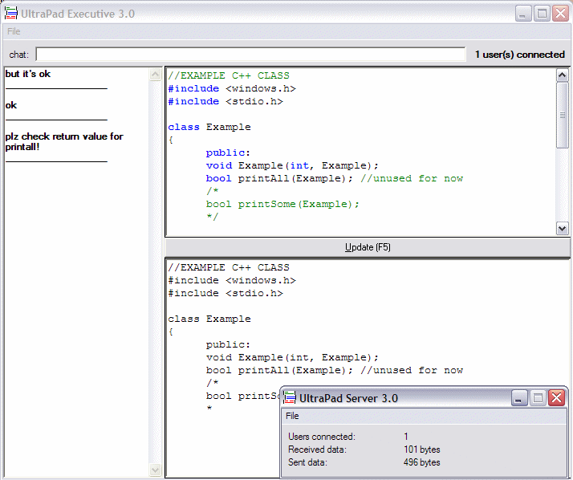



## \_\*\*UltraPad \- almost realtime multi user notepad\!

### Description

This is specifically intended for programmers.

With this you can edit a file simultaneously with your friends over a network or Internet.

Programmers can easily build modules with this programs, all working on ONE file, and being

able to see realtime what other users types.

There is an integrated chat to communicate.

Also there is a simple word highlighter, working for C++ syntax, that may be easily changed for VB structures.

There are two separate apps (server and client) to make it extremely tidied up.

Hope you like, try it!!

send feedback and report bugs! because i feel there are some.... :) and suggest on how I can improve this, for now it may be basic for someone... :)
 
### More Info
 

             |
---                |---
**Submitted On**   |2003-02-21 15:15:04
**By**             |[Enrico Bertozzi](https://github.com/Planet-Source-Code/PSCIndex/blob/master/ByAuthor/enrico-bertozzi.md)
**Level**          |Intermediate
**User Rating**    |4.8 (53 globes from 11 users)
**Compatibility**  |VB 5\.0, VB 6\.0
**Category**       |[Complete Applications](https://github.com/Planet-Source-Code/PSCIndex/blob/master/ByCategory/complete-applications__1-27.md)
**World**          |[Visual Basic](https://github.com/Planet-Source-Code/PSCIndex/blob/master/ByWorld/visual-basic.md)
**Archive File**   |[\_\_\_UltraPa1548262212003\.zip](https://github.com/Planet-Source-Code/enrico-bertozzi-ultrapad-almost-realtime-multi-user-notepad__1-43418/archive/master.zip)

